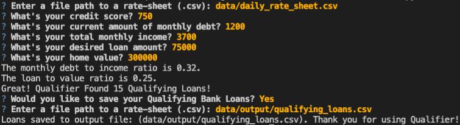
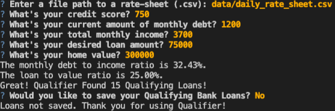
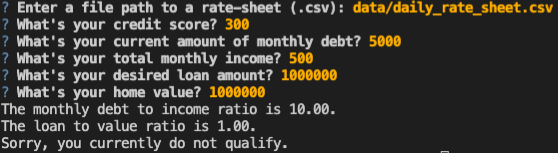

# Qualifier

This is a python command-line interface application that allows users to see qualifying loans from lenders quickly and easily. The application works by that taking in a `daily_rate_sheet` of loan criteria from various loan providers, asks the user a number of questions to evaluate their loan eligibility, and then returns to them a list of qualifying loans. User also has the option to save a .csv of qualified loans to a output path of their choice.

---

## Technologies

This project leverages python 3.7 with the following packages:

* [fire](https://github.com/google/python-fire) - For the command line interface, help page, and entrypoint.

* [questionary](https://github.com/tmbo/questionary) - For interactive user prompts and dialogs

* [pytest](https://docs.pytest.org/en/stable/) - For basic assertion testing of financial calculators and filters, and filio.

---

### Installation Guide

Before running the application first install the following dependencies.

```python
  pip install fire
  pip install questionary
  pip install pytest
  pip install mkdocs
```

---

## Examples

**Credit Score Filter.**
*This script filters a bank list by the user's minimum credit score.*
```def filter_credit_score(credit_score, bank_list):
    """Filters the bank list by the mininim allowed credit score set by the bank.

    Args:
        credit_score (int): The applicant's credit score.
        bank_list (list of lists): The available bank loans.

    Returns:
        A list of qualifying bank loans.
    """

    credit_score_approval_list = []
    for bank in bank_list:
        if credit_score >= int(bank[4]):
            credit_score_approval_list.append(bank)
    return credit_score_approval_list
```
**Debt to Income Filter.**
*This script filters the bank list by the applicant's maximum debt-to-income ratio.*
```def filter_debt_to_income(monthly_debt_ratio, bank_list):
    """Filters the bank list by the maximum debt-to-income ratio allowed by the bank.

    Args:
        monthly_debt_ratio (float): The applicant's monthly debt ratio.
        bank_list (list of lists): The available bank loans.

    Returns:
        A list of qualifying bank loans.
    """

    debit_to_income_approval_list = []
    for bank in bank_list:
        if monthly_debt_ratio <= float(bank[3]):
            debit_to_income_approval_list.append(bank)
    return debit_to_income_approval_list
```

**Loan to Value Filter.**
*This script filters the bank list by the applicant's maximum home loan to home value ratio.*
```def filter_loan_to_value(loan_to_value_ratio, bank_list):
    """Filters the bank list by the maximum loan to value ratio.

    Args:
        loan_to_value_ratio (float): The applicant's loan to value ratio.
        bank_list (list of lists): The available bank loans.

    Returns:
        A list of qualifying bank loans.
    """

    loan_to_value_approval_list = []

    for bank in bank_list:
        if loan_to_value_ratio <= float(bank[2]):
            loan_to_value_approval_list.append(bank)
    return loan_to_value_approval_list
```

**Max Loan Size Filter.**
*This script filters the bank list by comparing the user's loan value against the bank's maximum loan size.*
```def filter_max_loan_size(loan_amount, bank_list):
    """Filters the bank list by the maximum allowed loan amount.

    Args:
        loan_amount (int): The requested loan amount.
        bank_list (list of lists): The available bank loans.

    Returns:
        A list of qualifying bank loans.
    """

    loan_size_approval_list = []

    for bank in bank_list:
        if loan_amount <= int(bank[1]):
            loan_size_approval_list.append(bank)
    return loan_size_approval_list
```
---

## Usage

To use the loan qualifier application simply clone the repository and run the **app.py** with:

```python
python app.py
```

Upon following the loan qualifier prompts you will find below various input-dependent results.







---

## Contributors

Brought to you by Robert Giannini.
LinkedIn: https://www.linkedin.com/in/robertgianninijr/

---

## License

MIT
